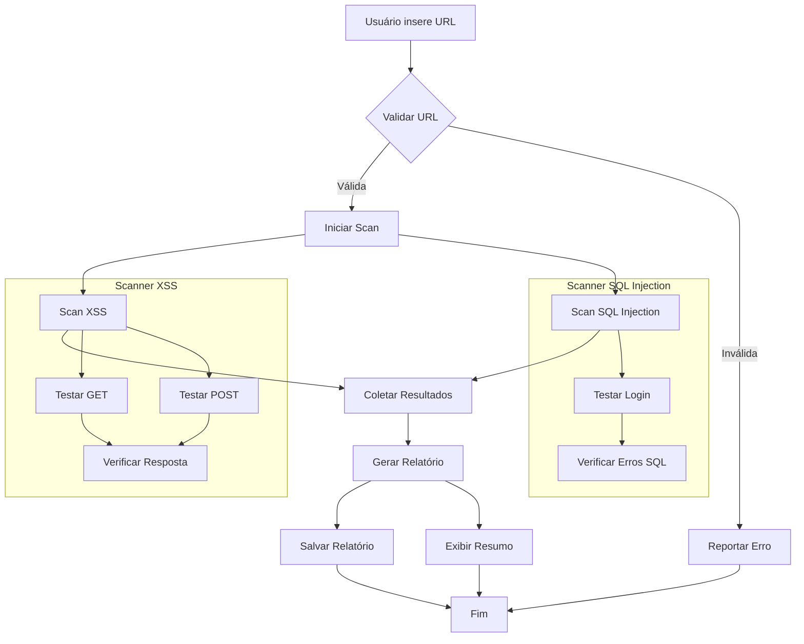

```mermaid
flowchart TD
    A[Usuário insere URL] --> B{Validar URL}
    B -->|Válida| C[Iniciar Scan]
    B -->|Inválida| D[Reportar Erro]
    
    C --> E[Scan XSS]
    C --> F[Scan SQL Injection]
    
    E --> G[Coletar Resultados]
    F --> G
    
    G --> H[Gerar Relatório]
    H --> I[Salvar Relatório]
    H --> J[Exibir Resumo]
    
    D --> K[Fim]
    I --> K
    J --> K

    subgraph "Scanner XSS"
    E --> E1[Testar GET]
    E --> E2[Testar POST]
    E1 --> E3[Verificar Resposta]
    E2 --> E3
    end

    subgraph "Scanner SQL Injection"
    F --> F1[Testar Login]
    F1 --> F2[Verificar Erros SQL]
    end
```
